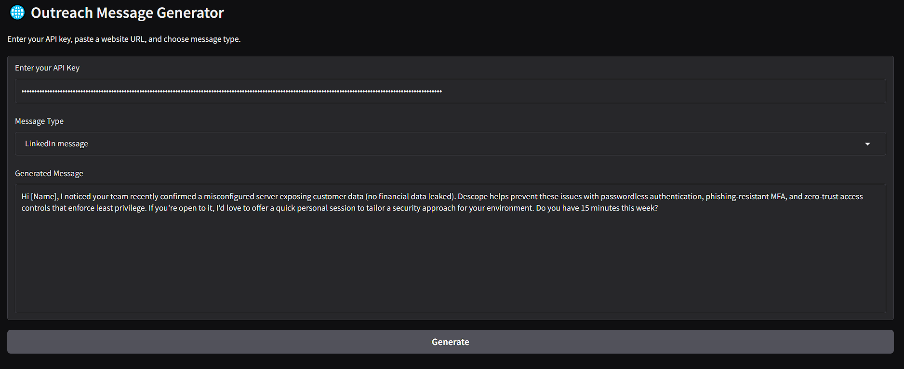
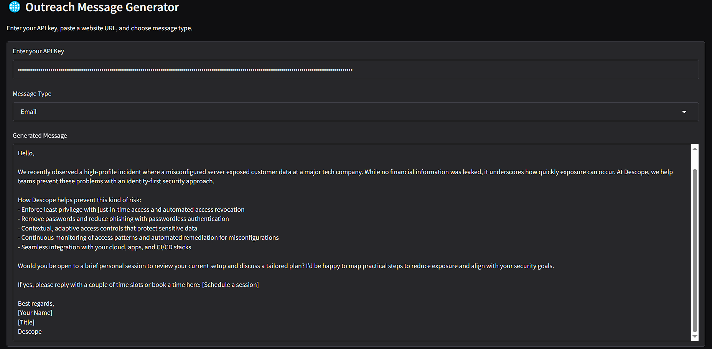

## 🔐 Cybersecurity Outreach Message Generator

This project was built as part of an internship application for Descope.
It tackles the challenge of identifying cybersecurity issues from external sources (websites, forums, news) and automatically generating personalized LinkedIn or Email outreach messages that position Descope as a solution provider.

## 🚀 Project Overview
Scrapes information from a given Google URL to detect potential cybersecurity challenges faced by companies.

Uses OpenAI GPT models to generate professional outreach messages (LinkedIn or Email) tailored to the detected problem.

Designed with a modular architecture — the current demo works with website URLs, but it can be extended to ingest data from:

Reddit (r/cybersecurity) discussions

LinkedIn job postings or company updates

Other threat intelligence sources

Provides a simple Gradio UI to test and demonstrate the pipeline interactively.
## 📦 Installation

Clone the repository and install dependencies:

```bash
git clone <your-repo-url>
cd <your-repo-folder>
pip install -r requirements.txt
```
Run the Jupyter Notebook to launch the Gradio app: 

```bash
jupyter notebook descope.ipynb
```

Once running, open the Gradio UI in your browser, enter your OpenAI API key, and generate outreach messages.


## ⚙️ Tech Stack

**Python** – Core programming language

**Jupyter Notebook** – Development & prototyping environment

**Gradio** – Web-based UI for easy interaction

**BeautifulSoup4 / Requests** – Web scraping from Google URLs

**OpenAI API** – Natural language generation (personalized outreach messages)
## 🖥️ How it works
- User launches the Gradio UI (via Jupyter Notebook).

-  Inputs:

    - OpenAI API key (securely entered in the app)

    - Website URL to scrape

    - Choice of message type: LinkedIn or Email

-  Backend Process:

    - Scrapes text from the provided URL

    - Extracts context about the company’s potential security challenges

    - Generates a tailored outreach message suggesting how Descope can help

- Output:

    A personalized, professional message ready to be sent via LinkedIn or Email


## 🔮 Future Potential

This project demonstrates how AI can bridge the gap between security signal detection and business development.

With additional resources (APIs, data sources), it could:

- Continuously monitor Reddit, LinkedIn, and other platforms for security-related posts.

- Detect companies actively struggling with cybersecurity issues.

- Automatically prepare personalized outreach campaigns for Descope’s sales or marketing teams.

- Scale into a full lead-generation and engagement system.
## 🙌 Why This Matters

Cybersecurity is often a reactive space — companies voice concerns only after issues surface.
This project shows how Descope can proactively identify and reach out to companies, offering solutions at the right time with the right context..


## Example 

